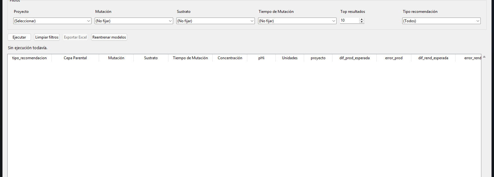

# Recomendador de Ensayos

Aplicación de escritorio para uso interno de laboratorio que recomienda parámetros de ensayos
de fermentación (cepa, mutación, sustrato, tiempo de mutación, concentración, pH, etc.). Entrena
modelos de machine learning sobre datos históricos de laboratorio y predice, para cada
combinación candidata, la diferencia esperada de productividad (`AQ`) y de rendimiento (`AR`),
para luego rankear las mejores combinaciones por proyecto.

## Captura de pantalla



## Stack

- **Lenguaje:** Python 3.
- **Interfaz:** Tkinter / `ttk` (aplicación de escritorio nativa, sin navegador).
- **Machine learning:** scikit-learn — `ExtraTreesRegressor` afinado con `RandomizedSearchCV`,
  dentro de un `Pipeline` con `ColumnTransformer` (imputación + `OneHotEncoder` para
  categóricas, imputación por mediana para numéricas).
- **Datos:** `pandas` / `numpy` para carga y limpieza; archivos fuente en `.xlsx`.
- **Persistencia de modelos:** `joblib` (los modelos entrenados se cachean en disco y solo se
  reentrenan si cambian los datos de entrenamiento).
- **Empaquetado:** PyInstaller, para distribuir la app como un `.exe` de Windows sin requerir
  Python instalado en el equipo del usuario final.

## Estructura del proyecto

La aplicación completa está organizada así:

```
├── recomendador_nuevo.py        # Punto de entrada (este repo solo incluye este archivo)
├── modulos/
│   ├── recomendador_config.py   # Rutas, constantes, reglas de negocio por proyecto, logging
│   ├── recomendador_utils.py    # Funciones puras: limpieza de datos, scoring, reglas
│   ├── recomendador_engine.py   # RecomendadorEngine: carga de datos, entrenamiento, ranking
│   └── recomendador_gui.py      # RecomendadorApp: interfaz Tkinter
├── Base_Datos_IA_2026_corregido.xlsx     # Datos históricos (confidencial)
├── base_entrenamiento_balanceada.xlsx    # Datos de entrenamiento (confidencial)
├── modelos_entrenados.pkl        # Modelos ya entrenados, cacheados
└── test_recomendador.py          # Tests (lógica pura + integración)
```

> **Este repositorio público solo contiene `recomendador_nuevo.py`.** Los módulos internos
> (`modulos/`), los datos históricos/de entrenamiento y los modelos entrenados son propiedad de
> la empresa y se mantienen en un repositorio privado.

## Requisitos previos

- Python 3.10+
- Dependencias: `pandas`, `numpy`, `scikit-learn`, `joblib`, `openpyxl` (lectura/escritura de
  `.xlsx`); `pytest` para tests; `pyinstaller` para generar el ejecutable.

  ```bash
  pip install pandas numpy scikit-learn joblib openpyxl pytest pyinstaller
  ```

## Configuración

Para ejecutar la app completa se necesitan, junto a `recomendador_nuevo.py`:

1. La carpeta `modulos/` con los cuatro módulos internos.
2. Los archivos de datos `Base_Datos_IA_2026_corregido.xlsx` y
   `base_entrenamiento_balanceada.xlsx` en la raíz del proyecto.

Ninguno de estos dos puntos está disponible en este repositorio público por ser información
confidencial de la empresa.

## Ejecutar el proyecto

```bash
python recomendador_nuevo.py
```

En el primer arranque (o si los datos de entrenamiento cambiaron) la app entrena los modelos y
los cachea en `modelos_entrenados.pkl`; en arranques posteriores los carga directo desde ahí.

Para generar el ejecutable de Windows:

```bash
pyinstaller "Sucroal Recomendador de Ensayos.spec"
```

## Funcionalidades

- Filtros en cascada por proyecto, mutación, sustrato y tiempo de mutación, poblados
  dinámicamente a partir de los datos históricos disponibles para cada combinación.
- Modelos dedicados para los proyectos `MN` y `ACTA`, y un modelo `GLOBAL` combinado para el
  resto de proyectos.
- Ranking de combinaciones candidatas por un score que prioriza cumplir simultáneamente los
  umbrales de productividad y rendimiento.
- Distinción entre recomendaciones **históricas reales** (combinaciones que ya existen en los
  datos) y **nuevas** (predichas por el modelo, con su margen de error asociado).
- Exportación de resultados a Excel.
- Reentrenamiento manual de los modelos desde la propia interfaz.

## Notas

- No requiere backend, base de datos externa ni conexión a internet: es una app de escritorio
  autocontenida que corre localmente sobre archivos Excel.
- No maneja autenticación de usuarios ni datos personales; el alcance de seguridad relevante es
  no exponer los archivos de datos ni el modelo entrenado fuera del entorno de la empresa.
